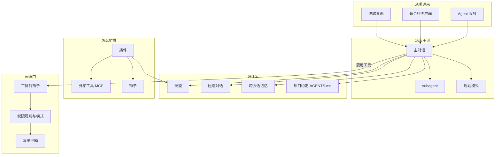

---
tags:
  - grok-build
  - harness
  - user-guide
  - permissions
  - subagents
  - memory
  - hooks
  - plugins
  - skills
  - sandbox
  - headless
source: crates/codegen/xai-grok-pager/docs/user-guide/
focus:
  - 19-plan-mode.md
  - 22-permissions-and-safety.md
  - 16-subagents.md
  - 13-memory.md
  - 10-hooks.md
  - 09-plugins.md
  - 08-skills.md
  - 14-headless-mode.md
  - 18-sandbox.md
related: "[[Grok Build 入门教程精炼]]"
created: 2026-08-09
---

# Grok Build 核心机制精炼

> 基于 user-guide 24 篇专题中的 **8 篇核心机制文档**，概述 harness 如何约束、扩展与自动化 Agent。  
> 风格：比入门教程更完整，但**先讲地图，不展开实现细节**。细节回原文或 `/docs`。

---

## 0. 总览：六层安全与扩展栈

```
你 / CI / SDK
    │
    ▼
┌─────────────────────────────────────────┐
│  会话形态：TUI 交互  ·  Headless 脚本     │
├─────────────────────────────────────────┤
│  工作方式：Plan Mode  ·  Subagents       │
├─────────────────────────────────────────┤
│  上下文：Memory  ·  Compaction  ·  Rules │
├─────────────────────────────────────────┤
│  扩展点：Skills · Plugins · Hooks · MCP  │
├─────────────────────────────────────────┤
│  授权：Permission Mode + allow/ask/deny  │
├─────────────────────────────────────────┤
│  硬隔离：OS Sandbox + shell env 策略     │
└─────────────────────────────────────────┘
```

| 层 | 一句话 | 主要文档 |
|----|--------|----------|
| **Plan Mode** | 先只读规划、你批准后再写码 | 19 |
| **Permissions** | 模型「想做什么」要不要问你、能不能做 | 22 |
| **Subagents** | 子会话独立上下文，并行委托 | 16 |
| **Memory** | 跨会话记住事实/决策（实验性，默认关） | 13 |
| **Skills / Plugins / Hooks** | 可复用流程、打包分发、生命周期脚本 | 08 / 09 / 10 |
| **Headless** | `-p` 无交互跑一轮，接 CI/脚本 | 14 |
| **Sandbox** | 内核级限制进程能读写/联网的范围 | 18 |

**关键心智：**

1. **Permissions** 管「Agent 请求是否被批准」  
2. **Sandbox** 管「即使批准了，OS 还允不允许」  
3. **Hooks** 可在两者之前再插一层策略（但 **fail-open**）  
4. **Plan Mode** 是流程闸门：规划阶段几乎不能改业务文件  

---

## 1. 权限模型：Permission Modes + Rules

*来源：`22-permissions-and-safety.md` + `19-plan-mode.md`*

### 1.1 两套旋钮

| 旋钮            | 作用                                         |
| ------------- | ------------------------------------------ |
| **Mode（模式）**  | 整体基线：多问你？还是直接放行/直接拒？                       |
| **Rules（规则）** | 在基线上叠加：某类工具/路径/命令 `allow` / `ask` / `deny` |

规则永远叠在模式上；**`deny` 永远赢过 `allow` 和 always-approve 的默认放行**。

### 1.2 有哪些 Mode

| Mode                | 产品称呼                      | 默认行为                               | 适合               |
| ------------------- | ------------------------- | ---------------------------------- | ---------------- |
| `default`           | **ask**                   | 只读工具/命令自动过，其余常会问                   | 日常交互             |
| `acceptEdits`       | —                         | 改文件不弹窗                             | 本地写码、事后看 diff    |
| `plan`              | —                         | 兼容 Claude 设置；真正规划用 Plan Mode       | 兼容配置             |
| `auto`              | —                         | 安全检查放行常规操作，其余拦截/升级                 | 想少打断的交互          |
| `dontAsk`           | —                         | 只跑已预批的 + 内置只读                      | 严格 CI 白名单        |
| `bypassPermissions` | **always-approve / yolo** | 大体自动批（deny/hooks/部分 shell ask 仍生效） | 自动化、agent server |

**always-approve 与 auto 互斥**（同时要时 always-approve 优先）。  
组织可用 `requirements.toml` 的 `disable_bypass_permissions_mode` **锁死** always-approve。

**怎么切：**

- TUI：`Shift+Tab` 循环 Normal → Plan → Always-approve；`Ctrl+O` / `/always-approve`；`/auto`；`/settings`
- CLI：`--always-approve` / `--yolo` / `--permission-mode <mode>`
- 配置：`[ui] permission_mode = "…"`；也读 Claude 的 `permissions.defaultMode`

### 1.3 一次工具调用怎么被授权（顺序）

```
1. PreToolUse hooks     → 可 deny（hook 说 allow 也不会跳过后面）
2. Permission rules     → deny > ask > allow（全源合并）
3. 记住的交互授权       → 本项目内「Always allow 某命令」
4. 内置只读自动批       → read/grep/安全 shell 段 等
5. Mode 策略            → 再问你 / 自动批 / 自动拒
```

**Always-approve 短路：** 走完 hooks + rules 后，一般不再问；但：

- `deny` 仍拦  
- hooks 仍拦  
- **shell 分段匹配的 `ask` 规则**仍可拦  
- **不查**「记住的授权 / never allow」  
- 非 shell 的 `ask` 规则不再弹窗  

### 1.4 默认永远不问的操作

- **只读工具**：`read_file`、`list_dir`、`grep`、`web_search`、`todo_write`、子 agent 控制、调用 skill 等  
- **只读 shell 段**（链式拆开后逐段认）：`ls`/`cat`、只读 git、`rg`/`grep`、部分 `kubectl get/logs/describe` 等  

链式例子：`ls && rm -rf tmp` → `ls` 只读，`rm` 仍会问（`dontAsk` 下则拒）。  
**只读列表是便利，不是安全边界。**

### 1.5 规则写在哪、怎么匹配（概述）

| 范围               | 位置                            | 是否共享           |
| ---------------- | ----------------------------- | -------------- |
| 全局               | `~/.grok/config.toml`         | 否              |
| 项目（可提交）          | `.grok/config.toml`           | 是              |
| 项目个人             | `.claude/settings.local.json` | 否（应 gitignore） |
| 交互「Always allow」 | Grok 内部状态，按项目                 | 否              |
| CLI              | `--allow` / `--deny`（可重复）     | 当次进程           |


**Bash 注意：**

- `deny`/`ask`：**每个段** + 整串都查  
- `allow`：只对**整串**匹配 → `Bash(git *)` 会放行 `git status && rm -rf /`（所以要配 deny）  
- 危险内置列表（`rm`、`chmod`、`git push`…）：即使有「记住的前缀」也会再问；显式 allow / always-approve 可放行  

### 1.6 交互授权

弹窗典型选项：Allow once / Reject once / 开 always-approve /（改文件）本会话允许全部编辑。  
开启 `remember_tool_approvals` 后可出现「Always allow `cargo test`」类持久授权——**按项目、不写进仓库**。

### 1.7 推荐组合姿势

| 场景 | 建议 |
|------|------|
| 日常写码 | `default` + 少量 `Bash(git *)` 等窄 allow |
| 只读评审 | deny `edit`/`bash`，allow `read`/`grep` |
| CI 自动化 | `always-approve` + **deny 硬边界** +（可选）PreToolUse 白名单 hook |
| 不信任代码 | `dontAsk` + 窄 allow + **sandbox strict** + 审查 SessionStart hooks |

---

## 2. Plan Mode：规划闸门

*来源：`19-plan-mode.md`*

### 2.1 是什么

结构化规划阶段：

1. 只读探索代码库  
2. 把方案写到 **session 内的 `plan.md`**  
3. 可 `ask_user_question` 澄清  
4. `exit_plan_mode` → 你审阅批准后再实现  

**唯一可写路径：plan 文件。** 其他文件编辑一律拒绝——即使 always-approve 开着。  
状态与 always-approve 可「叠着」：规划期拦写文件；退出 Plan 后 always-approve 再恢复。

### 2.2 怎么进

| 方式 | 说明 |
|------|------|
| Agent 发起 | `enter_plan_mode`（需你批）——任务真正模糊时 |
| 你发起 | `/plan`、`/plan <任务>`；或 `Shift+Tab` 切到 Plan |
| 回看 | `/view-plan`（别名 `/show-plan` 等） |

**适合：** 架构歧义大、多种合理路线、搞错代价高。  
**不适合：** 小改、明显路径、纯探索（探索用 **explore 子 agent**）。

### 2.3 审批 UI（概述）

| 键 | 含义 |
|----|------|
| `a` | 批准并开始实现（可带评论） |
| `s` | 要求修改 |
| `c` | 对选中行评论 |
| `y` | 复制全文 |
| `q` | 放弃方案并退出 Plan |

可多轮迭代；`/compact` 期间 Plan 状态会保留。

### 2.4 和 subagent 的关系（重要）

你在**规划模式**里时，拦的是**主对话**改业务文件——**拦不住 subagent**。

- 全能型 subagent（`general-purpose`）照样可能改文件  
- 它还会跟着主对话的权限习惯走（包括「全部自动批准」）  
- 只读型（`explore` / `plan`）主要靠「自己没有写文件工具」来限制  

**记住：** 规划模式 ≠ 全家桶只读。真要防写，还得靠权限规则、沙箱，或别派会写文件的 subagent。


---

## 3. Subagents：叫帮手一起干

*来源：`16-subagents.md`*

### 3.1 是什么

**subagent = 主agent派出去的独立小agent。**

- 有自己的对话上下文，不和主agent抢同一块「记忆空间」  
- 干完把**摘要**交回主对话  
- 主agent可以继续干别的  
- 默认是开的  

### 3.2 Agent vs Personas

两个容易混的东西：

|     | **Agent类型**                | **Personas**        |
| --- | -------------------------- | ------------------- |
| 管什么 | 这一趟「能用哪些工具、偏什么活」           | 叠在上面的「说话方式 / 输出习惯」  |
| 用在哪 | 主agent或 subagent 都行        | **只作用在 subagent 上** |
| 例子  | 全能、`explore` 调研、`plan` 出方案 | 「写得短一点」「像研究员」       |

一句话：**类型决定能干什么；Personas 决定怎么干、怎么写。**  
管理入口：`/config-agents`、`/personas`。

### 3.3 自带的几种类型

| 类型 | 干什么 |
|------|--------|
| `general-purpose` | 默认全能，能读能写能跑命令 |
| `explore` | 调研：读、搜、可跑命令，**不改文件** |
| `plan` | 帮你出实现方案，**不改文件** |

项目或你自己还可以加新类型，或同名盖掉内置的。

### 3.4 单独工作区

**工作区：**

- **共用**（默认）— 和主对话改同一份代码  
- **单独 worktree** — 各自一份检出，改完再合回去；结果里会带上那份目录路径  

### 3.5 怎么跑、有什么限制

- 主对话派出 subagent；可以**后台跑**，先拿一个编号，稍后取结果  
- **接着上一个接着干**：可以指定「从某个已完成的 subagent 接着聊」，方便「先调研再实现」这种流水线  
- **只能嵌一层**：subagent **不能再派 subagent**，防止套娃爆炸  
- **外部工具（MCP）**：默认沿用主对话已经连上的；也可以配置只继承一部分  
- 来自插件的角色：安全起见，**不能**自己再塞一套 MCP / 钩子 /「全部自动批准」  

### 3.6 界面上在哪看

- 主对话滚动区：有一条「subagent 开始/结束」的小块，回车可进完整过程  
- `Ctrl+G` 任务面板：有 Subagents 分组  
- 进到子会话里时，多半是**旁观**，不像主对话那样随便接着聊  

### 3.7 什么时候值得用

**适合：** 一边调研一边主线继续；边写边测；独立审查；几件事互不挡。  
**不适合：** 一句话就能干完；需要和你频繁来回确认；准备工作比并行本身还贵。

---

## 4. 记忆：隔天还记得（跨会话）

*来源：`13-memory.md`*  
（同一会话里「对话太长要压缩」用 `/compact`；这里的记忆解决的是 **今天关掉、明天再开还记不记得**。）

### 4.1 是什么

- **默认关**，还算实验功能  
- 打开后：你存过的约定、结论、踩坑经验会被索引，新会话会自动搜相关的  
- 和仓库里的 `AGENTS.md` 互补：  
  - `AGENTS.md` = 写在项目里的团队约定  
  - 记忆 = 你和 Grok 慢慢攒下的「活知识」  

### 4.2 怎么开 / 关（谁说了算）

从强到弱：

1. `--no-memory` — 强制关，谁也拗不过  
2. `--experimental-memory` — 这次打开  
3. 环境变量 `GROK_MEMORY=1` 或 `0`  
4. 配置文件里打开  
5. 默认：关  

会话里临时开关：`/memory on` / `/memory off`（不写回配置文件）。

### 4.3 存在哪

都在 `~/.grok/memory/` 下面，大致三类：

| 东西 | 管什么 |
|------|--------|
| 全局 `MEMORY.md` | 跨项目的个人习惯 |
| 某个项目目录下的 `MEMORY.md` | 这个项目专用 |
| `sessions/` 里一堆日志 | 每次会话的摘要 |

同一个远程仓库的不同克隆、worktree，一般**共用**同一份项目记忆。  
底下有搜索索引（关键词 + 可选语义相似）。

### 4.4 怎么写进去、怎么整理

| 方式 | 你会得到什么 |
|------|----------------|
| 会话正常结束 | 自动存一点「聊了啥」的目录信息（**不再调一次模型**）；太短的会话跳过 |
| `/flush` | 让模型总结「这次真正重要的」，写进会话日志；**压缩对话前很有用** |
| `/remember` 或直接说「记住……」 | 写进 `MEMORY.md`（会先给你确认） |
| 说「忘掉……」 | 尽量删匹配项；想稳就自己改文件 |
| `/dream` | 把零碎日志整理成不那么重复的主题知识；也可以攒够次数/时间自动跑 |

### 4.5 怎么用进对话

- **新会话第一轮**：自动按当前项目搜相关记忆塞进来  
- **对话被自动压缩后**：再搜一轮，把可能挤掉的相关内容捞回来  
- 你也可以让它「搜记忆」「读某份记忆文件」  
- 旧会话的记忆会慢慢「变淡」；全局/项目长期记忆不会标过期  

### 4.6 和「压缩对话」怎么配合

压缩前可以先把要点冲进记忆，再腾出对话空间。  
很老的工具输出也会被裁短/清空，省额度。

**好习惯：** 重要结论 → `/remember` 或 `/flush` → 再 `/compact`。

### 4.7 日常维护

- 浏览：`/memory`  
- 清空：`grok memory clear`（可清当前项目 / 全局 / 全部）  
- 也可用编辑器直接改 `~/.grok/memory/` 下的文件，下次搜索会重新索引  

---

## 5. 怎么扩展：技能 · 插件 · 钩子

三块拼起来就是「可定制」的主路径：

| 东西 | 白话 |
|------|------|
| **技能（Skills）** | 教它「这类活按这几步做」 |
| **插件（Plugins）** | 把技能、钩子、外部工具等**打包**给别人装 |
| **钩子（Hooks）** | 在关键时刻**自动跑一段脚本**（拦命令、记日志、测过再收工…） |

---

### 5.1 技能（Skills）

*来源：`08-skills.md`*

**是什么：** 一个文件夹 + 一份 `SKILL.md`（开头几行元信息 + 后面的步骤说明）。  
适合：太具体、不该塞满 `AGENTS.md`，又不想每次重新打一长串说明。

**从哪找得到（同名时，更靠近你当前目录的优先）：**

- 当前目录 / 仓库里的 `.grok`、`.agents`、`.claude`、`.cursor`  
- 你用户目录下的 `~/.grok`、`~/.claude`、`~/.cursor`  
- 配置里额外指定的目录；系统自带的在 `~/.grok/bundled/skills/`  

`commands/` 下单独的 `.md` 文件也会变成斜杠命令（兼容 Claude 老习惯）。

**怎么用：**

- 打斜杠：`/技能名 参数`  
- 模型也可能根据「什么时候用」的描述**自己调用**（可在文件里关掉自动调用，只许你手动斜杠）  
- 和内置命令撞名：内置占短名，技能用 `local:` / `user:` / 插件名前缀  

**怎么建：** 手写文件夹，或 `/create-skill`（选存项目里还是只给你自己用）。  
**查装了啥：** `grok inspect`。

**建议：** 「什么时候触发」写清楚；一个技能只干一件事；团队公用的提交进 git。

---

### 5.2 插件（Plugins）

*来源：`09-plugins.md`*

**是什么：** 一次安装，可以顺带带来：技能、斜杠命令、角色、钩子、外部工具（MCP）等。

**两步，别混：**

1. **加市场（marketplace）** — 只是挂上一个「货架」，还不装东西  
2. **装某个插件** — 默认不算「信任」；加上 `--trust` 后，钩子和外部工具才会真正跑  

**信任是啥意思：**

| | 技能 / 命令 / 角色 | 钩子 / 外部工具 |
|--|-------------------|----------------|
| 启用了但还没信任 | 技能侧可以用 | **不跑** |
| 装在 `~/.grok/plugins/` | 自动信任 | 自动信任 |
| 装在项目 `.grok/plugins/` | 要你明确信任 | 要你明确信任 |

**日常操作：**

- 命令行：`grok plugin install` / `list` / `enable` / `disable` …  
- 界面：`/plugins`，或 `Ctrl+L`（在 VS Code 一类终端里用 `/plugins` 更稳）  
  里面有：钩子、插件、市场、技能、外部工具 几页  

**给全公司推：** 管理端配置可以预装市场、强制开启某些插件、限制只能用哪些市场/哪些外部服务；也可以要求安装必须钉死某个提交版本。

插件目录里常见：`skills/`、`commands/`、`agents/`、钩子配置、`.mcp.json` 等。

---

### 5.3 钩子（Hooks）

*来源：`10-hooks.md`*

**是什么：** 到了某个时刻，自动跑**本地脚本**或**发一个网络请求**。  
常见用途：危险命令先拦、记审计日志、改完代码自动格式化、会话开始准备环境、**测试没过就不许收工**。

#### 什么时候会触发（能不能拦住）

| 时机 | 白话 | 能拦住吗 |
|------|------|----------|
| 会话开始 / 结束 | 开关门 | 否 |
| 你提交了一条消息 | 你一按发送 | 否 |
| **工具马上要执行** | 改文件、跑命令前 | **能拦下** |
| 工具成功 / 失败后 | 事后 | 否 |
| 权限系统已经拒绝 | 事后通知 | 否 |
| **这一轮正常收工** | 它说干完了 | **能逼它接着干** |
| 接口报错结束 | 出错了 | 否 |
| subagent 开始 / 结束 | 帮手起停 | 结束时也能拦 |
| 压缩对话前 / 后 | 上下文压缩 | 否 |
| 通知 | 弹提示 | 否 |


#### 几条最重要的规矩

- **匹配器**：可只盯某类工具、某种 subagent、某种压缩原因等；Claude 里的 `Bash` 这类旧名也能对上  
- **失败就当放行（很重要）**：脚本崩了、超时了、输出乱了 → **不会当成「禁止」**，只记一笔。  
  当安全门用的钩子，必须自己明确写出「拒绝」和原因，不能靠「脚本挂了 = 安全」  
- **收工门**：可以说「还没测过，别停」；理由会喂回模型再跑一轮。同一轮大概最多续大约 8 次，之后强制停  
- **项目里的钩子**：要先信任这个文件夹（`/hooks-trust` 或启动时 `--trust`），和项目本地外部工具同一道闸  
- 钩子也可以写在配置文件 / 公司下发配置里，多层是**叠起来跑**，不是互相盖掉  

#### 和权限怎么配合

```
钩子先说「不许」 → 到此结束
钩子说可以 / 钩子自己挂了 → 再走权限规则 → 再看当前权限模式
```

钩子适合「灵活判断」；**写死的禁止规则**更适合当硬边界。别指望单靠钩子就当保险箱。

---

### 5.4 该用哪个

| 你想… | 优先用 |
|------|--------|
| 重复的一套步骤 | **技能** |
| 团队共享一整包技能+钩子+外部工具 | **插件 + 市场** |
| 危险命令拦一下 / 测绿才能停 | **钩子**（最好再加禁止规则） |
| 接 GitHub、数据库这类外部服务 | **MCP（外部工具）**，可用插件打包 |
| 换一种干活风格 / 工具集合 | **角色类型 / Personas** |

---

## 6. 无界面模式：给脚本和 CI 用

*来源：`14-headless-mode.md`*

### 6.1 是什么

不打开终端界面：你给一句任务，它跑完，把结果打到标准输出，进程退出。

```bash
grok -p "你的任务写在这里"
```

用 `-p`、从文件读任务、或 JSON 形式的任务，都会走这种模式。

### 6.2 自动化常开的开关

| 类别 | 开关 | 白话 |
|------|------|------|
| 权限 | `--always-approve` / `--yolo` | 别弹窗，直接干（禁止规则和钩子仍生效） |
| 权限 | `--permission-mode`、`--allow`、`--deny` | 和交互时同一套「准 / 不准」规则 |
| 工具 | `--tools` 只留这些 / `--disallowed-tools` 去掉这些 | **只有无界面模式**有；可禁掉所有 subagent，或只禁某类 |
| 轮次 | `--max-turns N` | 最多来回几轮，控时间和钱 |
| 隔离 | `--sandbox …` | 见下一章 |
| 输出 | `--output-format …` | 给人看还是给脚本解析 |
| 会话 | `-c` 续最近一次；`-r` 续指定会话 | 默认每次都是新会话，要连续得显式续 |

### 6.3 结果怎么吐出来

| 格式 | 适合 |
|------|------|
| 纯文本（默认） | 人看、重定向到文件 |
| `json` | 跑完一个大 JSON：正文、会话编号、用量、费用等 |
| `streaming-json` | 一行一个事件，边跑边解析（自家格式） |
| `streaming-messages-json` | 更接近常见 Messages 流式格式，方便已有工具接 |

CI 里最常见：`json`，再用 `jq` 抠正文或会话编号。

### 6.4 会话、中断、登录

- 默认**每次新开**；要接着聊用 `-r` 或 `-c`  
- 被打断（Ctrl+C 等）：尽量保存到最后一个跑完的工具；**已经改过的文件不会自动撤销**  
- 流水线环境登录：设 `XAI_API_KEY`，或用设备码登录  
- `~/.grok` 可以只读挂进容器（会话可能存不住）  

### 6.5 常见写法

```bash
# 评审结果写进文件
grok -p "评审这些改动…" --output-format json --yolo | jq -r '.text' > review.md

# 只许读，不许乱改
grok -p "解释这个代码库" --tools "read_file,grep,list_dir"

# 自动批 + 硬禁止某类危险命令
grok -p "部署…" --always-approve --deny 'Bash(rm -rf *)'
```

和「Agent 服务 / 双向协议」不同：无界面是**单向跑完**；要边跑边审批、当 SDK 用，走 `grok agent` 那条路。

---

## 7. 沙箱：操作系统硬隔离

*来源：`18-sandbox.md`*

### 7.1 是什么

启动时给 **整个 Grok 进程** 套上系统级限制（Linux / macOS 上用内核能力），管它能读哪、写哪，以及（在 Linux 上）子进程能不能上网。  
**默认关。** 一旦套上，**中途不能再放宽**。

对照记：

|     | 权限规则        | 沙箱           |
| --- | ----------- | ------------ |
| 管的是 | 「它请求的事，批不批」 | 「进程物理上碰不碰得到」 |
| 例子  | 门禁登记        | 锁上的房间        |

两层最好一起用。

### 7.2 自带几档

| 档位 | 读 | 写 | 子进程上网* | 适合 |
|------|----|----|-------------|------|
| 关 | 随便 | 随便 | 随便 | 默认 |
| `workspace` | 全盘 | 当前目录 + `~/.grok` + 临时目录 | 可以 | **日常推荐** |
| `devbox` | 全盘 | 顶层目录几乎都能写 | 可以 | 一次性开发机 |
| `read-only` | 全盘 | 只能写 `~/.grok` 和临时目录 | 禁* | 评审、只看不改 |
| `strict` | 基本只限当前目录+系统路径 | 当前目录 + `~/.grok` + 临时目录 | 禁* | 不信任的代码 |

\* 子进程断网：**主要在 Linux 生效**；macOS 上这层往往等于没断。  
Grok 自己调模型、网页搜索这类**进程内联网**一般仍可用（它得上网才能干活）。

### 7.3 什么时候开

| 你想… | 用 |
|------|-----|
| 日常防乱写 | `workspace` |
| 挡 `.env`、证书这类路径 | 自定义 + `deny` |
| 只分析、不改项目文件 | `read-only` |
| 审不信任代码 | `strict` + 权限尽量白名单 |
| 要全局装依赖、改仓库外文件 | 可能得关掉或放宽 |

---

## 8. 怎么叠着用（场景）

### A. 本地做大功能

```
规划模式先出方案 → 你批准
再正常模式写代码（默认会问危险操作）
需要时派 explore 型 subagent 调研
写好 AGENTS.md + 项目技能
```

### B. 不信任的第三方仓库

```
沙箱开 strict
权限尽量「不问就拒」+ 很窄的允许，或钩子白名单
先 /hooks 看项目里有没有钩子；真要跑再信任文件夹
审计用只读 subagent
```

### C. CI 自动修测 / 出报告

```
grok -p "…" --yolo --output-format json
再加 --deny 挡住危险命令


可选 --sandbox workspace 或 strict
--max-turns 控成本和时间
不想分叉就禁掉 subagent
用 API Key 登录
```

### D. 团队统一工具链

```
用插件市场发「技能 + 钩子 + 外部工具」
公司配置统一启用
可锁死「不许全部自动批准」/ 安装必须钉版本
项目里提交禁止规则
```

### E. 希望隔天还记得

```
打开记忆
关键结论 /remember 或 /flush
压缩对话前先 flush
偶尔 /dream 整理一堆
```

---

## 9. 别混了（对照表）

| 概念 | 不是… | 是… |
|------|--------|------|
| 权限模式 | 系统沙箱 | 「问不问你、默不默认批」 |
| 禁止规则 | 进程锁死 | 对「想调用的工具」说不 |
| 钩子拒绝 | 单独就能当保险柜 | 可编程门禁，**挂了会放行** |
| 沙箱 | 弹窗确认 | 操作系统强制的读写/网络边界 |
| 规划模式 | 另一种权限模式 | **先方案、少改文件** + 你点头再写 |
| **subagent** | 另一套系统权限 | **独立小会话**（可选单独 worktree） |
| 技能 | 装一个软件 | 可复用的**流程说明** |
| 插件 | 装系统程序 | 把技能/钩子/外部工具**打成一包** |
| 记忆 | 当前对话的压缩 | **跨会话**长期知识 |
| 无界面模式 | 双向 Agent 服务 | 命令行**跑完就退出** |
| `--tools` | 权限允许 | **直接卸掉**某些工具（无界面） |
| `--allow` | 卸掉工具 | 工具还在，只是执行要过门 |

---

## 10. 常用入口速查

| 目的 | 怎么进 |
|------|--------|
| 权限模式 | `Shift+Tab`、`/always-approve`、命令行权限开关、配置 |
| 规划 | `/plan`、`Shift+Tab`、`/view-plan` |
| subagent / Personas | `/config-agents`、`/personas`、`Ctrl+G` |
| 记忆 | 打开实验记忆、`/memory`、`/remember`、`/flush`、`/dream` |
| 技能 | `/skills`、`/create-skill`、`grok inspect` |
| 插件 | `/plugins`、`grok plugin …` |
| 钩子 | `/hooks`、`/hooks-trust`、`Ctrl+L`（部分终端） |
| 无界面 | `grok -p "…"`，输出用 json，自动化加 `--yolo` |
| 沙箱 | `grok --sandbox workspace`，或 `sandbox.toml` |
| 看加载了啥 | `grok inspect`、`/doctor` |

---

## 11. 原文在哪

| 文件 | 主题 |
|------|------|
| `19-plan-mode.md` | 规划模式 |
| `22-permissions-and-safety.md` | 权限与安全 |
| `16-subagents.md` | subagent、Personas |
| `13-memory.md` | 跨会话记忆 |
| `08-skills.md` | 技能 |
| `09-plugins.md` | 插件与市场 |
| `10-hooks.md` | 钩子 |
| `14-headless-mode.md` | 无界面 / 脚本 |
| `18-sandbox.md` | 沙箱 |

仓库：`grok-build/crates/codegen/xai-grok-pager/docs/user-guide/`

终端里也可：`/docs`。

---

## 12. 总图（白话版）



---

*操作入门和快捷键见 [[Grok Build 入门教程精炼]]。*  
*这篇是机制地图；某一块要抠细节再说，可以再拆专篇。*

